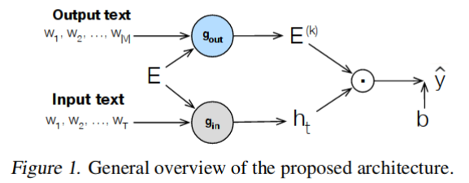

<b>drill</b> —
a Pytorch implementation of DRILL which allows to build deep residual output layers for neural language generation, to be presented at ICML 2019 [<a href="https://arxiv.org/pdf/1905.05513.pdf">1</a>]. Our deep output mapping explicitly captures the similarity structure of the output space while it avoids overfitting with two different dropout strategies between layers, and preserves useful information with residual connections to the word embeddings and, optionally, to the outputs of previous layers. Evaluations on three language generation tasks show that our output label mapping can match or improve state-of-the-art recurrent and self-attention architectures.

<p align="center">
<a href="https://arxiv.org/pdf/1905.05513.pdf"></a>
</p>

```
@inproceedings{Pappas_ICML_2019,
  author    = {Nikolaos Pappas, James Henderson},
  title     = {Deep Residual Output Layers for Neural Language Generation},
  booktitle = {Proceedings of the 36th International Conference on Machine Learning},
  address   = {Long Beach, California},
  year      = {2018}
}
```

Installation
------------
The code for DRILL requires <a href="http://www.python.org/getit/">Python 3.5</a> programming language and <a href="http://www.pip-installer.org/en/latest/">pip</a> package manager to run.
For detailed instructions on how to install them please refer to the corresponding links. Next, you should be able to install the required libraries as follows using the provided list of dependencies: <br />
```
pip install -r dependencies.txt
```
To avoid creating library conflicts in your existing pip environment, it may be more convenient to use a folder-specific pip environment with <a href="https://github.com/pypa/pipenv">pipenv</a> instead. Our experiments were run on NVIDIA GTX 1080 Ti GPUs with <a href="https://developer.nvidia.com/cuda-downloads">CUDA 8.0</a> and <a href="https://developer.nvidia.com/cudnn">cuDNN 5110</a>.

To obtain our pretrained models from Google Drive directly from command line you can download the following script: 
```
wget https://raw.githubusercontent.com/circulosmeos/gdown.pl/master/gdown.pl; chmod +x gdown.pl;
```
To obtain the corresponding datasets for language modeling and machine translation please follow the instructions from [<a href="https://arxiv.org/pdf/1708.02182.pdf">2</a>] and [<a href="https://papers.nips.cc/paper/7181-attention-is-all-you-need.pdf">3</a>] respectively, e.g. the former can be easily obtained by running <a href="https://github.com/salesforce/awd-lstm-lm/blob/master/getdata.sh">this</a> script.
 
# Language Modeling

Under the main folder (./) you can find the code related to the neural language modeling experiments on PennTreebank and Wikitext-2 datasets from [<a href="https://arxiv.org/pdf/1708.02182.pdf">2</a>]. Note that a large portion of this repository is borrowed from <a href="https://github.com/salesforce/awd-lstm-lm">awd-lstm</a>. Below you can find the commands for training our model on the two examined datasets.

Penn Treebank
------------
The commands for our main results in Table 1 and 4 are the following:

```bash
python main.py --data data/penn --dropouti 0.4 --dropouth 0.25 --seed 28 --batch_size 20 --epoch 1000 \ 
--save exp/pen-drill-4l --joint_emb 400 --joint_emb_depth 4 --joint_dropout 0.6 --joint_locked_dropout \
--joint_emb_activation Sigmoid
```

```bash
python finetune.py --data data/penn --dropouti 0.4 --dropouth 0.25 --seed 28 --batch_size 20 --epoch \
1000 --save exp/pen-drill-4l --joint_emb 400 --joint_emb_depth 4 --joint_dropout 0.6  --joint_locked_\
dropout --joint_emb_activation Sigmoid
``` 

Our pretrained version of the above model can be obtained as follows:

```
./gdown.pl https://drive.google.com/open?id=1H6xELj0gaqhiAZJUzPuKJmMqws3WWbLx penn.zip
```

Wikitext-2
-----------
The commands for our main results in Table 2 are the following:
 
```bash
python main.py --data data/wiki2 --dropouth 0.2 --seed 1882 --epoch 2000  --save exp/wiki2-drill --joint\
_emb 400 --joint_emb_depth 4 --joint_dropout 0.6 --joint_emb_activation ReLU
```

```bash
python finetune.py --data data/wiki2 --dropouth 0.2 --seed 1882 --epoch 2000  --save exp/wiki2-drill \
--joint_emb 400 --joint_emb_depth 4 --joint_dropout 0.6 --joint_emb_activation ReLU
```

Our pretrained version of the above model can be obtained as follows:

```
./gdown.pl https://drive.google.com/open?id=1WlCiYEQOJoXLCu0yKQXArJsr_q3vqYtw wiki2.zip
```

# Machine Translation
Under the onmt/ folder you can find the code related to the neural machine translation experiments on the WMT 2014 English to German dataset as in [<a href="https://papers.nips.cc/paper/7181-attention-is-all-you-need.pdf">3</a>]. Due to its large scope, we haven't included the whole <a href="https://github.com/OpenNMT/OpenNMT-py">OpenNMT-py</a> framework but one can directly copy our files to the original onmt/ directory. Below you can find the command for training our model.

 
En-De (32K BPE)
-----------

The command for our main results in Table 5 is the following:

```bash
python train.py -data data/en-de_32k -save_model drill -layers 6 -rnn_size 512 -word_vec_size 512 -transformer_ff 2048 -heads 8 -encoder_type transformer -decoder_type transformer -position_encoding -train_steps 350000 -max_generator_batches 2 -dropout 0.1 -batch_size 4096 -batch_type tokens -normalization tokens  -accum_count 2 -optim adam -adam_beta2 0.998 
-decay_method noam -warmup_steps 8000 -learning_rate 2 -max_grad_norm 0 -param_init 0  -param_init_glorot -label_smoothing 0.1 -valid_steps 10000 -save_checkpoint_steps 10000 -world_size 1 -gpu_ranks 0 -share_decoder_embeddings --joint_emb 512 --joint_emb_depth 2 --joint_dropout 0.0 --joint_locked_dropout --joint_emb_activation Sigmoid  
```
Our pretrained version of the above model can be obtained as follows:

```
 ./gdown.pl https://drive.google.com/open?id=1xZyZ8P97roMuhRSrxn6HTURgTEs2r9FM en-de_32k.zip 
```

References
------------
* [1] Nikolaos Pappas, James Henderson, <a href="https://arxiv.org/pdf/1806.06219.pdf">Deep Residual Output Layers for Neural Language Generation</a>, Thirty-sixth International Conference on Machine Learning, Long Beach, California, 2019
* [2]  Stephen Merity, Nitish Shirish Keskar, Richard Socher, <a href="https://arxiv.org/pdf/1708.02182.pdf">Regularizing and Optimizing LSTM Language Models</a>, Sixth International Conference on Learning Representations, Vancouver, Canada, 2018
* [3] Ashish Vaswani, Noam Shazeer, Niki Parmar, Jakob Uszkoreit, Llion Jones, Aidan N. Gomez, Lukasz Kaiser, Illia Polosukhin <a href="http://aclweb.org/anthology/D15-1027">Attention is All You Need</a>, Advances in Neural Information Processing Systems, Montreal, Canada, 2018
 
Acknowledgements
------------
This work was supported by the European Union through SUMMA project (n. 688139) and the Swiss National Science Foundation within INTERPID project (FNS-30106).  

## Contact:
npappas@idiap.ch

